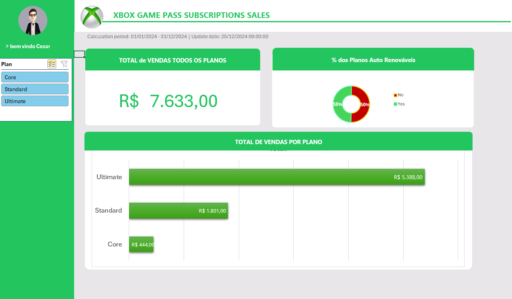

# Criando um Dashboard de Vendas do Xbox com Excel

Aprenda a criar um dashboard de vendas, com foco na organização e visualização de dados.
Este repositório contém um exercício prático de dashboard desenvolvido em Excel, abordando técnicas e recursos aprendidos durante BootCamp Heineken - Inteligência Artificial Aplicada a Dados com Copilot da DIO. O dashboard tem como foco apresentar visualmente e de maneira intuitiva dados relacionados à venda de assinaturas do serviço Xbox Game Pass.

## 📌 Objetivos do Desafio de Projeto

O objetivo é transformar dados brutos em informações visuais claras e úteis, permitindo uma análise eficaz do desempenho de vendas e a tomada de decisões baseadas em dados.

O desafio de projeto teve como objetivo consolidar conhecimentos em:

- Criação e organização de **tabelas dinâmicas**.
- Desenvolvimento de gráficos dinâmicos e interativos.
- Aplicação de ferramentas de filtragem e segmentação (**Slicers**).
- Design de dashboard claro e informativo.

## 📊 Conteúdo do Dashboard

O dashboard apresenta dados fictícios de vendas relacionados aos diferentes planos do serviço Xbox Game Pass (Core, Standard, Ultimate). As informações representadas no painel são:

- Valor total arrecadado com vendas de todos os planos.
- Representação percentual dos planos auto-renováveis e não renováveis.
- Distribuição do valor total das vendas, separadas por plano de assinatura.

## 🚀 Ferramentas e Técnicas Utilizadas

Durante a construção do dashboard, foram exercitados:

- **Tabelas Dinâmicas:** para realizar cálculos automáticos, totalizações e agrupamentos dos dados.
- **Gráficos de Barras:** para visualização clara das vendas segmentadas por cada plano.
- **Gráfico de Rosca (Donut chart):** utilizado para demonstrar proporções relacionadas aos planos auto-renováveis.
- **Segmentação de Dados (Slicers):** para permitir filtragem dinâmica e interativa por tipo de plano.
- **Formatação Condicional:** para destacar os dados mais relevantes visualmente.
- **Elementos visuais e design:** garantindo uma aparência profissional e agradável, utilizando cores e formatações adequadas ao tema do Xbox.

## 🔧 Aprendizados

Com este exercício, foi possível aprofundar os conhecimentos em:

- Integração entre tabelas dinâmicas e gráficos.
- Técnicas avançadas de formatação e design visual em Excel.
- Criação de dashboards intuitivos e funcionais para tomada de decisão rápida.

## 🖥️ Resultado Final

O resultado deste exercício é um dashboard funcional, interativo e visualmente atraente, que exemplifica como o Excel pode ser uma ferramenta poderosa para apresentação de dados e tomada de decisões estratégicas.

## 📁 Estrutura do Projeto

- `ImageDashboard.png`: Imagem do dashboard construído.
- `README.md`: Documentação explicativa do projeto.
- `Meu Dashboard em Excel.xlsx`: Arquivo excel com o Dashboard construído. 

---

### ✅ Status

- [x] Concluído
- [ ] Em andamento
- [ ] Aguardando revisão

---

Este projeto representa um marco no desenvolvimento de dashboards eficientes com Excel, mostrando o poder e as possibilidades dessa ferramenta em ambientes corporativos e analíticos.

📌 **Observação:** Os dados utilizados são puramente fictícios e têm como único objetivo o aprendizado.

---

🧑‍💻 **Autor:** Cezarino Martins da Hora

📅 **Data:** Abril/2025
